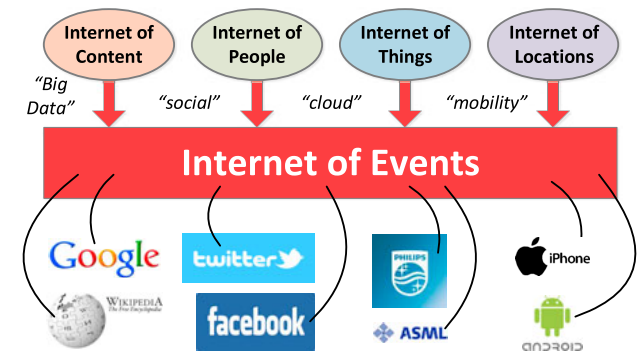
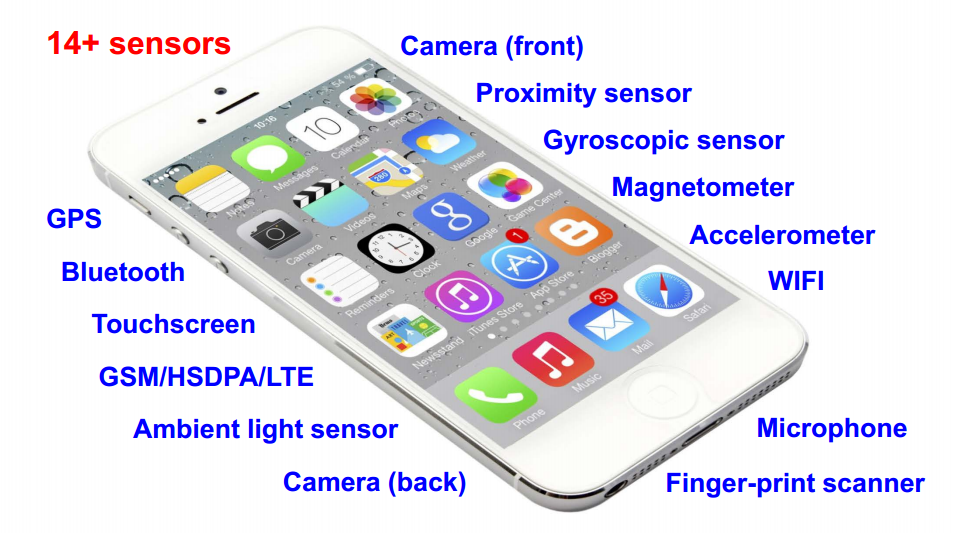
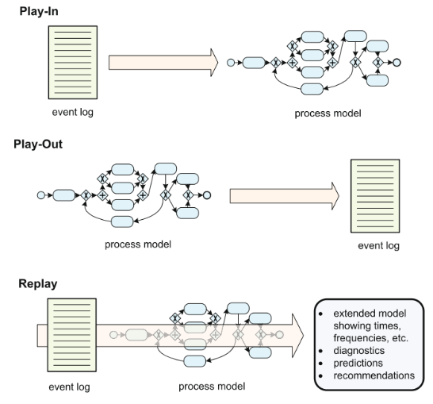

Nesta aula veremos um pouco sobre a mineração de processos, área essa que relaciona a modelagem de sistemas com a ciência de dados, permitindo transformar registros de eventos em melhorias para processos.  

## Dados é o novo petróleo!

Hoje em dia, nós estamos gerando uma quantidade de dados maior do que se juntarmos todas as informações da pré-história até o ano de 2003. 

Estamos criando constantemente **dados de evento (event data)**, quando

- marcamos uma consulta
- compramos uma xicara de café
- enviamos um e-mail
- assistimos um vídeo no YouTube
- através de todos os sensores em um smartphone

Quando falamos de todos esses dados sendo gravados, estamos falando da **Internet dos Eventos**.

  Frequentemente, estamos gerando dados de eventos

  Sensores e interfaces de smartphones capturam dados

### Big Data

Hoje nós conseguimos criar e gravar uma enorme quantidade de dados. 

Para se ter uma ideia dessa evolução, pode-se citar **Lei de Moore** é a observação de que o número de transistores em circuitos integrados dobra aproximadamente a cada dois anos, o que resulta em um aumento exponencial na capacidade de processamento dos computadores. Proposta por Gordon Moore em 1965, essa tendência impulsionou a evolução da tecnologia por décadas. No entanto, à medida que os transistores se aproximam dos limites físicos, a Lei de Moore começa a desacelerar, desafiando a indústria a buscar novas soluções, como a computação quântica.

  2²⁰ = 1.048.576 * em 40 anos

Portanto, o desafio hoje é encontrar valor nesses dados.

####  Os 4 desafios do Big Data

- Volume: estamos criando grandes quantidades de dados
- Velocidade: a rapidez que os dados estão sendo criados e modificados
- Variedade: os dados não mudam apenas de tipo mas também de fontes como imagens, textos, vídeos, e devemos trabalhar com todos eles
- Veracidade: por conta do volume massivo de dados, pode existir uma dificuldade em verificar a confiabilidade dos dados

## A demanda por cientistas de dados

A crescente demanda por cientistas de dados é impulsionada pela necessidade das empresas de transformar grandes volumes de dados em informações úteis para tomar decisões mais informadas e estratégicas. 

Cientistas de dados aplicam técnicas de mineração de dados, como clustering, classificação, regressão e análise preditiva, para extrair padrões e insights de conjuntos de dados complexos. 

Esses profissionais desempenham um papel fundamental na análise de dados não estruturados e estruturados, utilizando ferramentas e algoritmos sofisticados para transformar dados brutos em conhecimento acionável.

### Ramos da Ciência de Dados

### Exemplo na Construção Civil:

/i.s3.glbimg.com/v1/AUTH_63b422c2caee4269b8b34177e8876b93/internal_photos/bs/2023/h/z/pnqTRSRoKK769dnnyaGg/8f75f61f-3207-4286-bc8b-678ffa51555d.jpg)

Na construção civil, a mineração de dados e a ciência de dados podem ser aplicadas para melhorar a eficiência dos projetos e reduzir custos. Um exemplo prático seria o uso de **análise preditiva** para otimizar o cronograma de obras. Cientistas de dados podem analisar dados históricos de projetos anteriores, como tempos de construção, custos de materiais, condições climáticas e desempenho de equipamentos. Usando técnicas de mineração de dados, como **modelagem preditiva**, é possível identificar padrões que indicam quais fatores mais impactam o progresso de uma obra. Com essas informações, as empresas podem prever possíveis atrasos e ajustar os cronogramas de forma mais eficaz, além de otimizar os recursos, como mão de obra e equipamentos, garantindo um melhor controle de custos.

Outro exemplo é o uso de **sensores IoT** em canteiros de obras, que geram dados em tempo real sobre a utilização de máquinas e materiais. Cientistas de dados podem analisar esses dados para detectar ineficiências, prever manutenções de máquinas e otimizar o consumo de recursos.

Esses avanços proporcionam maior previsibilidade, redução de riscos e uma gestão mais eficaz em grandes projetos de construção civil.

## Mineração de Processos

A **mineração de processos**, ou **process mining**, é um área que combina **modelos de processos de négocio** com a Ciência de Dados, ou seja, a partir de event logs ocorre a extração do modelo dos processos ou a análise de desempenho, gargalos, conformidade e etc.

Desse modo, a mineração de processos é um elo crucial entre a ciência de dados, que lida com a análise e interpretação dos dados, e o estudo de processos, que foca na melhoria contínua e na eficiência organizacional. Ao aplicar métodos de análise avançada, como aprendizado de máquina e visualização de dados, ela proporciona uma visão detalhada e realista de como os processos funcionam, ajudando as empresas a otimizá-los com base em dados reais.

### Event Logs

**Event log** ou **registros de evento** são tabelas que contém as informações de execução dos processos. Nesta tabela, cada linha representa um evento e contém ao menos três colunas essenciais, sendo elas
- case id - contém um identificador da instância do processo ao qual o evento pertence;
- activity - a atividade que foi realizada no evento;
- timestamp - a data e hora em que o evento ocorreu (inicio, fim ou outro marco temporal).
podem também ter outras colunas, como resources, que indicam o recurso ou pessoa responsável pela execução da atividade, além de  quaisquer outras informações relevantes. Vale dizer que nem sempre a tabela contém uma única coluna de timestamp. Em alguns casos, pode haver colunas separadas para o início e o fim de cada evento.

| _student name/caseId_ | _course name/activity_       | _exam date/timestamp_ | _mark/other data_ |
| --------------------- | ---------------------------- | --------------------- | ----------------- |
| Peter Jones           | Business Information Systems | 16-1-2014             | 8                 |
| Sandy Sott            | Business Information Systems | 16-1-2014             | 5                 |
| Bridget White         | Business Information Systems | 16-1-2014             | 9                 |
| Sandy Scott           | BPM Systems                  | 17-1-2014             | 8                 |
| Bridget White         | BPM Systems                  | 17-1-2014             | 7                 |
| Sandy Scott           | Process Mining               | 20-1-2014             | 9                 |
| John Anderson         | Process Mining               | 20-1-2014             | 6                 |

| _order number / caseId_ | _activity_     | _timestamp_     | _user / resource_ | _product / other data_ | _quantity / other data_ |
| ----------------------- | -------------- | --------------- | ----------------- | ---------------------- | ----------------------- |
| 9901                    | register order | 22-1-2014#09.15 | Sara Jones        | iPhone5s               | 1                       |
| 9902                    | register order | 22-1-2014#09.18 | Sara Jones        | iPhone5s               | 2                       |
| 9901                    | check stock    | 22-1-2014#09.49 | Pete Scott        | iPhone5s               | 1                       |
| 9901                    | ship order     | 22-1-2014#10.11 | Sue Fox           | iPhone5s               | 1                       |
| 9901                    | handle payment | 22-1-2014#10.41 | Carol Hope        | iPhone5s               | 1                       |

### Tipos de process mining

Na mineração de processos, os tipos Play-in, Play-out e Replay referem-se a diferentes maneiras de interagir com e analisar os processos dentro de um sistema.

####  **Play Out**
A ideia é gerar um comportamento, event log, a partir de um modelo. Por exemplo, considere o modelo abaixo

Podemos a partir desse modelo gerar o seguinte event log:

| case | activity                           | timestamp      | resource |
| ---- | ---------------------------------- | -------------- | -------- |
| 235  | register travel request (a)        | 18-8-2014:9.15 | John     |
| 235  | get support from local manager (b) | 18-8-2014:9.25 | Mary     |
| 235  | check budget by finance (d)        | 19-8-2014:8.55 | John     |
| 235  | decide (e)                         | 19-8-2014:9.36 | Sue      |
| 235  | accept request (g)                 | 19-8-2014.9.48 | Mary     |

#### **Play In**
Neste tipo geramos um modelo de processo a partir de um event log. Existem diversos algoritmos que fazem isso. Por exemplo, considere a seguinte sequência de letras, onde cada letra representa um evento:
- abdeg
- adbeg
- adbeh
- abdeh
A partir delas podemos determinar o seguinte modelo:

### **Replay** 
Por fim, no tipo replay nos buscamos verificar a conformidade do modelo de processos gerado ou já existente com a realidade. Desta forma podemos descobrir gargalos, processos sendo realizados fora de ordem, e outros desvios de desempenho.
