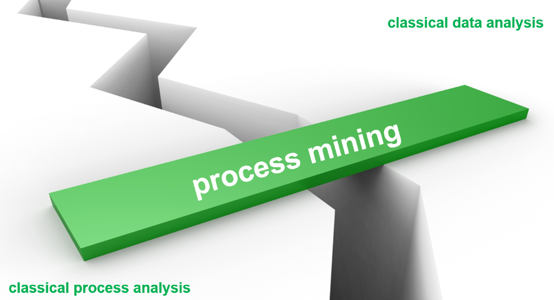

## Mineração de Processos

A **mineração de processos**, ou **process mining**, é um área que combina **modelos de processos de négocio** com a Ciência de Dados, ou seja, a partir de event logs ocorre a extração do modelo dos processos ou a análise de desempenho, gargalos, conformidade e etc.

Desse modo, a mineração de processos é um elo crucial entre a ciência de dados, que lida com a análise e interpretação dos dados, e o estudo de processos, que foca na melhoria contínua e na eficiência organizacional. Ao aplicar métodos de análise avançada, como aprendizado de máquina e visualização de dados, ela proporciona uma visão detalhada e realista de como os processos funcionam, ajudando as empresas a otimizá-los com base em dados reais.

### Event Logs

**Event log** ou **registros de evento** são tabelas que contém as informações de execução dos processos. Nesta tabela, cada linha representa um evento e contém ao menos três colunas essenciais, sendo elas
- case id - contém um identificador da instância do processo ao qual o evento pertence;
- activity - a atividade que foi realizada no evento;
- timestamp - a data e hora em que o evento ocorreu (inicio, fim ou outro marco temporal).
podem também ter outras colunas, como resources, que indicam o recurso ou pessoa responsável pela execução da atividade, além de  quaisquer outras informações relevantes. Vale dizer que nem sempre a tabela contém uma única coluna de timestamp. Em alguns casos, pode haver colunas separadas para o início e o fim de cada evento.

| _student name/caseId_ | _course name/activity_       | _exam date/timestamp_ | _mark/other data_ |
| --------------------- | ---------------------------- | --------------------- | ----------------- |
| Peter Jones           | Business Information Systems | 16-1-2014             | 8                 |
| Sandy Sott            | Business Information Systems | 16-1-2014             | 5                 |
| Bridget White         | Business Information Systems | 16-1-2014             | 9                 |
| Sandy Scott           | BPM Systems                  | 17-1-2014             | 8                 |
| Bridget White         | BPM Systems                  | 17-1-2014             | 7                 |
| Sandy Scott           | Process Mining               | 20-1-2014             | 9                 |
| John Anderson         | Process Mining               | 20-1-2014             | 6                 |

| _order number / caseId_ | _activity_     | _timestamp_     | _user / resource_ | _product / other data_ | _quantity / other data_ |
| ----------------------- | -------------- | --------------- | ----------------- | ---------------------- | ----------------------- |
| 9901                    | register order | 22-1-2014#09.15 | Sara Jones        | iPhone5s               | 1                       |
| 9902                    | register order | 22-1-2014#09.18 | Sara Jones        | iPhone5s               | 2                       |
| 9901                    | check stock    | 22-1-2014#09.49 | Pete Scott        | iPhone5s               | 1                       |
| 9901                    | ship order     | 22-1-2014#10.11 | Sue Fox           | iPhone5s               | 1                       |
| 9901                    | handle payment | 22-1-2014#10.41 | Carol Hope        | iPhone5s               | 1                       |

### Tipos de process mining

Na mineração de processos, os tipos Play-in, Play-out e Replay referem-se a diferentes maneiras de interagir com e analisar os processos dentro de um sistema.

####  **Play Out**
A ideia é gerar um comportamento, event log, a partir de um modelo. Por exemplo, considere o modelo abaixo

Podemos a partir desse modelo gerar o seguinte event log:

| case | activity                           | timestamp      | resource |
| ---- | ---------------------------------- | -------------- | -------- |
| 235  | register travel request (a)        | 18-8-2014:9.15 | John     |
| 235  | get support from local manager (b) | 18-8-2014:9.25 | Mary     |
| 235  | check budget by finance (d)        | 19-8-2014:8.55 | John     |
| 235  | decide (e)                         | 19-8-2014:9.36 | Sue      |
| 235  | accept request (g)                 | 19-8-2014.9.48 | Mary     |

#### **Play In**
Neste tipo geramos um modelo de processo a partir de um event log. Existem diversos algoritmos que fazem isso. Por exemplo, considere a seguinte sequência de letras, onde cada letra representa um evento:
- abdeg
- adbeg
- adbeh
- abdeh
A partir delas podemos determinar o seguinte modelo:

### **Replay** 
Por fim, no tipo replay nos buscamos verificar a conformidade do modelo de processos gerado ou já existente com a realidade. Desta forma podemos descobrir gargalos, processos sendo realizados fora de ordem, e outros desvios de desempenho.
