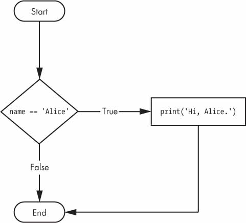
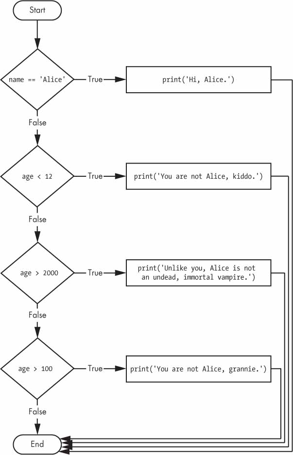
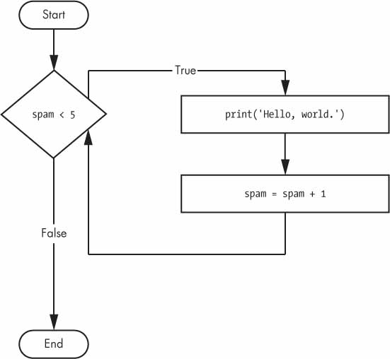
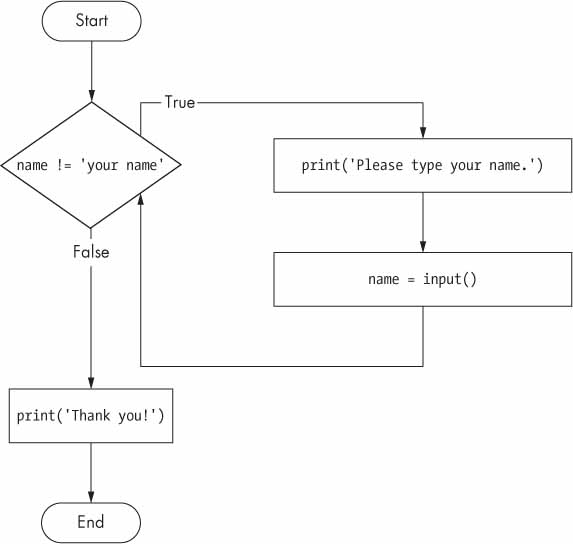
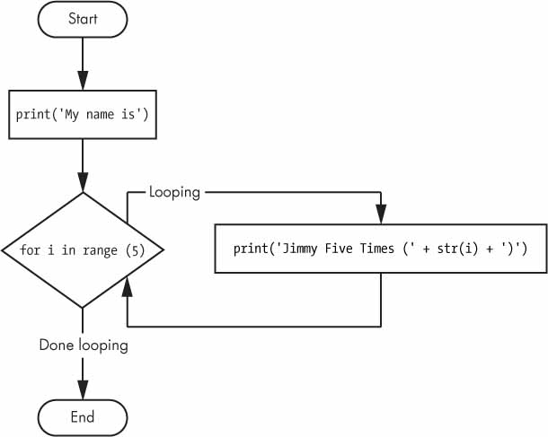

[Aula Anterior](aula01.md) | [Próxima Aula](aula03.md)

> - <a href="https://github.com/UniRobotica/cursos/blob/main/Informatica_Aplicada/Notebooks/Python%20Basico/Aula2_ControleFluxo.ipynb" target="_blank">Link da aula no Github</a><br>

> - <a href="https://colab.research.google.com/github/UniRobotica/cursos/blob/main/Informatica_Aplicada/Notebooks/Python%20Basico/Aula2_ControleFluxo.ipynb" target="_blank">Link da aula no Colab</a>


# CONTROLE DE FLUXO
Você conheceu o básico das instruções individuais e sabe que um programa é apenas uma série de instruções. 
Com base na forma como as expressões são avaliadas, um programa pode decidir pular instruções, repeti-las ou escolher uma das várias instruções para executar. 
As instruções de controle de fluxo podem decidir quais instruções Python serão executadas sob quais condições.

Essas instruções de controle de fluxo correspondem diretamente aos símbolos em um fluxograma

```python
# 1) DESCRIÇÃO NARRATIVA
# verificar se está chovendo
# se tiver verificar se tem guardachuva

# 2) PSEUDO-CÓDIGO
# INICIO
# SE ESTÁ CHOVENDO 
    # ENTAO VERIFICA SE TEM GUARDA CHUVA
        # SAIR
    # SENÃO AGUARDA UM MOMENTO
        # SE ESTÁ CHOVENDO
```


Em um fluxograma, geralmente há mais de um caminho a percorrer do início ao fim. O mesmo se aplica às linhas de código de um programa de computador. Os fluxogramas representam esses pontos de ramificação com losangos, enquanto as outras etapas são representadas com retângulos. As etapas inicial e final são representadas por retângulos arredondados.

# Valores booleanos
Embora os tipos de dados inteiro, ponto flutuante e string tenham um número ilimitado de valores possíveis, o tipo de dados Booleano possui apenas dois valores: True e False . (Booleano é maiúsculo porque o tipo de dados leva o nome do matemático George Boole.) 

Quando inserido como código Python, os valores booleanos True e False não possuem as aspas que você coloca em torno das strings e sempre começam com T ou F maiúsculo , com o resto da palavra em letras minúsculas. 

```python
isTrue = True
isTrue
```

```python
type(isTrue)
```

```python
isTrue
```

```python
True = 2 + 2
```

```python
if True:
    isTrue = 2 + 2
```

```python
isTrue
```

# Operadores de comparação
Operadores de comparação , também chamados de operadores relacionais , comparam dois valores e avaliam até um único valor booleano. 

| Operador | Significado          |
| -------- | -------------------- |
| ==       | Igual a              |
| !=       | Diferente de         |
| <        | Menor que            |
| >        | Maior que            |
| <=       | Menor que ou igual a |
| >=       | Maior que ou igual a |

== (igual a) é avaliado como True quando os valores em ambos os lados são iguais e 

!= (diferente de) é avaliado como True quando os dois valores são diferentes. 

Os operadores == e != podem realmente trabalhar com valores de qualquer tipo de dados.

```python
2 != 3
```

```python
2 != 2
```

```python
42 == '42'
```

```python
42 == 42.0
```

```python
42 == 0042.000
```

* Para formatar o número 1234.5678 com duas casas decimais e separador de milhares

```python
1234.56789
```

```python
numero = 1234.56789
formato = "{:.2f}".format(numero)
print(formato)
```

```python
numero = 1234.56789
formato = "{:,.2f}".format(numero)
print(formato)
```

* Outro método útil é o uso da função round(). Essa função permite arredondar um número para um determinado número de casas decimais. Por exemplo, para arredondar o número 3.14159 para duas casas decimais:

```python
numero = 3.14159
arredondado = round(numero, 2)
print(arredondado)
```

Os operadores < , > , <= e >= , por outro lado, funcionam corretamente apenas com valores inteiros e de ponto flutuante.

```python
42 > 100
```

```python
myAge = 29 # atribuição 
```

```python
myAge >= 10 # comparação
```

```python
myAge = 9
myAge < 10
```

>[!NOTE]
>Você deve ter notado que o operador == (igual a) possui dois sinais de igual, enquanto o operador = (atribuição) possui apenas um sinal de igual. É fácil confundir esses dois operadores. Apenas lembre-se destes pontos:
>
>O operador == (igual a) pergunta se dois valores são iguais.
>O operador = (atribuição) coloca o valor à direita na variável à esquerda.

# Operadores Booleanos
Os três operadores booleanos ( ``and`` , ``or`` , e ``not`` ) são usados ​​para comparar valores booleanos. Assim como os operadores de comparação, eles avaliam essas expressões até um valor booleano.

## Tabela Verdade do operador ``and``

| Expressão       | Resultado |
| --------------- | --------- |
| True  and True  | True      |
| True  and False | False     |
| False and True  | False     |
| False and False | False     |

## Tabela Verdade do Operador ``or``

| Expressão       | Resultado |
| --------------  | --------- |
| True  or True   | True      |
| True  or False  | True      |
| False or True   | True      |
| False or False  | False     |

## Tabela Verdade do Operador ``not``

| Expressão | Resultado |
| --------- | --------- |
| not True  | False     |
| not False | True      |

# Misturando operadores booleanos e de comparação
Como os operadores de comparação são avaliados como valores booleanos, você pode usá-los em expressões com os operadores booleanos.

Lembre-se de que os operadores and , or e not são chamados de operadores booleanos porque sempre operam nos valores booleanos True e False . Embora expressões como 4 <5 não sejam valores booleanos, elas são expressões avaliadas até valores booleanos.

```python
(4 < 5) and (5 < 6)
```


```python
(4 < 5) and (9 < 6)
```

```python
(4 < 5) or (9 < 6)
```

```python
2 + 2 == 4 and not 2 + 2 == 5 and 2 * 2 == 2 + 2
```

# Elementos de controle de fluxo
As instruções de controle de fluxo geralmente começam com uma parte chamada condição e são sempre seguidas por um bloco de código chamado cláusula .

# Condições
Condição é apenas um nome mais específico no contexto das instruções de controle de fluxo. As condições sempre são avaliadas como um valor booleano, True ou False . Uma instrução de controle de fluxo decide o que fazer com base no fato de sua condição ser True ou False , e quase todas as instruções de controle de fluxo usam uma condição

# Blocos de código
Linhas de código Python podem ser agrupadas em blocos . Você pode saber quando um bloco começa e termina pelo recuo das linhas de código. 

* Os blocos começam quando o recuo aumenta.
* Os blocos podem conter outros blocos.
* Os blocos terminam quando o recuo diminui para zero ou para o recuo de um bloco que o contém.

```python
name = input("Digite seu nome: ") # Atribua string Mary a variável name
password = input("Digite a senha: ")
if name == 'Mary' or 'mary': # SE variável name É IGUAL a 'Mary'
    print('Olá, Mary') # Mostra na Tela ('Olá, Mary')
    if password == 'swordfish':
          print('Acesso concedido.')
    else:
         print('Senha errada.')
else:
     print("Você não é Mary!")
```

Você pode ver a execução deste programa em <a href="https://autbor.com/blocks" target="_blank">https://autbor.com/blocks</a> .

## Declarações de controle de fluxo

# if

O tipo mais comum de instrução de controle de fluxo é a instrução if . A cláusula de uma instrução if (ou seja, o bloco após a instrução if ) será executada se a condição da instrução for True . A cláusula será ignorada se a condição for False .

Em linguagem simples, uma instrução if poderia ser lida como: 

“Se esta condição for verdadeira, execute o código na cláusula”. 

Em Python, uma instrução if consiste no seguinte:

* A palavra-chave if
* Uma condição (ou seja, uma expressão avaliada como True ou False )
* Dois pontos
* Começando na próxima linha, um bloco de código recuado (chamado de cláusula if )

```python
if name == 'Alice':
    print('Hi, Alice.')
```

```python
name
```



```python
name = 'Alice'
if name == 'Alice':
    print('Hi, Alice.')
```

# else
Uma cláusula if pode opcionalmente ser seguida por uma instrução else . A cláusula else é executada somente quando a condição da instrução if é False . 
Em linguagem simples, uma instrução else poderia ser lida como: 
“Se esta condição for verdadeira, execute este código. Ou então, execute esse código.” 
Uma instrução else não tem uma condição e, no código, uma instrução else sempre consiste no seguinte:

* A palavra-chave else
* Dois pontos
* Começando na próxima linha, um bloco de código recuado (chamado de cláusula else )


```python
name = 'John'
```

```python
if name == 'Alice':
    print('Hi, Alice.')
else:
    print('Hello, stranger.')
```

# elif
Embora apenas uma das cláusulas if ou else seja executada, você pode ter um caso em que deseja que uma das muitas cláusulas possíveis seja executada. 
A instrução elif é uma instrução “else if” que sempre segue um if ou outra instrução elif . Ele fornece outra condição que será verificada somente se todas as condições anteriores forem False . No código, uma instrução elif sempre consiste no seguinte:

* A palavra-chave elif
* Uma condição (ou seja, uma expressão avaliada como True ou False )
* Dois pontos
* Começando na próxima linha, um bloco de código recuado (chamado de cláusula elif )



```python
name = 'John'
age = 2001
if name == 'Alice':
    print('Hi, Alice.') #case 1
elif age < 12:
    print('You are not Alice, kiddo.') #2
elif age > 2000:
    print('Unlike you, Alice is not an undead, immortal vampire.') #3
elif age > 100:
    print('You are not Alice, grannie.') #4
```

```python
name = 'Carol'
age = 3000
if name == 'Alice':
    print('Hi, Alice.')
elif age < 12:
    print('You are not Alice, kiddo.')
elif age > 100:
    print('You are grannie.')
elif age > 2000:
    print('Unlike you, Alice is not an undead, immortal vampire.')

if name != 'Alice':
    print('You are not Alice, grannie.')
```

<a href="https://autbor.com/vampire2/" target="_blank">https://autbor.com/vampire2/</a>

```python
name = 'Mary'
password = 'swordfish'
if name == 'Mary':
    print('Hello, Mary')
if password == 'swordfish':
    print('Access granted.')
else:
    print('Wrong password.')
```

## while Loop

Você pode fazer um bloco de código ser executado repetidamente usando uma instrução while . O código em uma cláusula while será executado enquanto a condição da instrução while for True . No código, uma instrução while sempre consiste no seguinte:

* A palavra-chave while
* Uma condição (ou seja, uma expressão avaliada como True ou False )
* Dois pontos
* Começando na próxima linha, um bloco de código recuado (chamado de cláusula while )

# Exemplo com ``if``


```python
spam = 4
if spam < 5:
    print('Hello, world.')
    spam = spam + 1
```

```python
spam
```

# Exemplo com ``while``



```python
spam = 5
while spam < 5:
    print('Hello, world.')
    spam = spam + 1
```

```python
name = ''
while name != 'your name':
    print('Please type your name.')
    name = input()
print('Thank you!')
```

<a href="https://autbor.com/yourname/" target="_blank">https://autbor.com/yourname/</a>

>[Um loop while irritante]
Aqui está um pequeno exemplo de programa que irá pedir para você digitar, literalmente, seu nome .



Existe um atalho para fazer com que a execução do programa saia antecipadamente de uma cláusula do loop while . Se a execução atingir uma instrução break , ela sai imediatamente da cláusula do loop while . No código, uma instrução break contém simplesmente a palavra-chave break .

```python
while True:
    print('Please type your name.')
    name = input()
    if name == 'your name':
        break
print('Thank you!')
```


> Se você alguma vez executar um programa que tenha um bug que o faça travar em um loop infinito, pressione CTRL -C

```python
while True:
    print('Who are you?')
    name = input()
    if name != 'Joe':
        continue
    print('Hello, Joe. What is the password? (It is a fish.)')
    password = input()
    if password == 'swordfish':
        break
    print('Access granted.') 
```

Se o usuário inserir qualquer nome além de Joe, a instrução continue faz com que a execução do programa volte ao início do loop. Quando o programa reavaliar a condição, a execução sempre entrará no loop, pois a condição é simplesmente o valor True . Depois que o usuário passa dessa instrução if , é solicitada uma senha. Se a senha inserida for correta, a instrução break será executada e a execução sairá do loop while para imprimir Acesso concedido. Caso contrário, a execução continua até o final do loop while , onde retorna ao início do loop.


# Loop for e a função range()
O loop while continua em loop enquanto sua condição for True (que é a razão de seu nome), mas e se você quiser executar um bloco de código apenas um determinado número de vezes? Você pode fazer isso com uma instrução de loop for e a função range() .

No código, uma instrução for se parece com _for i in range(5):_ e inclui o seguinte:
* A palavra-chave for
* Um nome de variável
* A palavra-chave in
* Uma chamada ao método range() com até três números inteiros passados ​​para ele
* Dois pontos
* Começando na próxima linha, um bloco de código recuado (chamado de cláusula for )

```python
print('My name is')
for item in range(5): # de 0 a 4, i.e., limite superior não é considerado
    print('Jimmy Five Times (' + str(item) + ')')
```



<a href="https://autbor.com/fivetimesfor/" target="_blank">https://autbor.com/fivetimesfor/</a>

>Você também pode usar instruções ``break`` e ``continue`` dentro de loops ``for`` . A instrução ``continue`` continuará até o próximo valor do contador do loop ``for`` , como se a execução do programa tivesse atingido o final do loop e retornado ao início. Na verdade, você pode usar instruções ``continue`` e ``break`` apenas dentro de loops ``while`` e ``for`` . Se você tentar usar essas instruções em outro lugar, o Python apresentará um erro.

Quando Gauss era menino, um professor disse-lhes para somar todos os números de 0 a 100. O jovem Gauss inventou um truque inteligente para descobrir a resposta em poucos segundos, mas você pode escrever um programa Python com um loop for para fazer esse cálculo para você.

# Loop ``while`` equivalente

você pode usar um loop ``while`` para fazer a mesma coisa que um loop for ; 

loops ``for`` são apenas mais concisos

```python
print('My name is')
i = 0
while i < 5:
    print('Jimmy Five Times (' + str(i) + ')')
    i = i + 1
```

# Os argumentos inicial, final e gradual para range()
Algumas funções podem ser chamadas com vários argumentos separados por vírgula, e range() é um deles. Isso permite alterar o número inteiro passado para range() para seguir qualquer sequência de números inteiros, inclusive começando em um número diferente de zero.

```python
for i in range(12, 16):
    print(i)
```

A função range() também pode ser chamada com três argumentos. Os dois primeiros argumentos serão os valores inicial e final, e o terceiro será o argumento step . O passo é o valor pelo qual a variável é aumentada após cada iteração.

```python
for i in range(0, 10, 2):
    print(i)
```

```python
for i in range(5, -1, -1):
    print(i)
```

> Embora qualquer laço possa ser escrito usando ``while`` ou ``for``, a escolha é baseada principalmente no estilo. Por exemplo, se o laço precisa de uma inicialização e um incremento, então o ``for`` geralmente é usado. No caso em que o número de repetições não é pré-determinado em geral usa-se o ``while``.

O ``for`` também pode iterar sobre listas ou dicionarios:

```python
notas = [7.5, 6, 8]
media = 0

print("As suas notas na disciplina foram:")

for nota in notas:
    print(f"-- {nota}")
    media += nota/len(notas)

print(f"A média foi {media:.2f}")
```

```python
aluno = {
    'nome': "Pedro",
    'idade': "23",
    'curso': "Engenharia de Produção Civil"
}

print("-- Dados do aluno --")

for key, value in aluno.items():
    print(f"* {key}: {value}")
```

# Exemplo na Engenharia Civil

Como exemplo do que discutimos, vamos imaginar que temos um estoque de materiais que será utilizado em uma obra, e precisamos verificar se a quantidade disponível é suficiente. Para isso, devemos iterar sobre o dicionário que contém as quantidades dos materiais e verificar se estão corretas.

```python
materiais = {
    "areia": 20,   # em kg
    "cimento": 200,# em kg
    "tijolos": 500
}

for material, quantidade in materiais.items():
    if material == "areia" and quantidade < 50:
        print("Quantidade insuficiente de areia!")
    elif material == "cimento" and quantidade < 100:
        print("Quantidade insuficiente de cimento!")
    elif material == "tijolos" and quantidade < 300:
        print("Quantidade insuficiente de tijolos!")
    else:
        print(f"Quantidade suficiente de {material}.")
```

[Aula Anterior](aula01.md) | [Próxima Aula](aula03.md)
